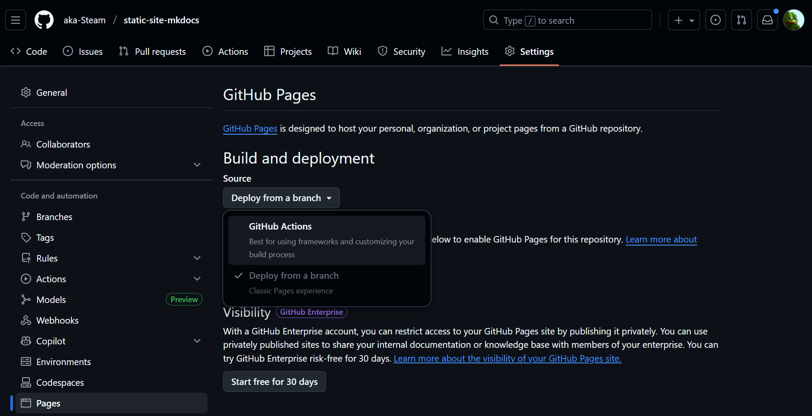

# Статический сайт: IT Рынок России

Статический сайт, созданный с помощью MkDocs и развернутый на GitHub Pages. Сайт посвящен анализу IT сектора экономики России.

## Технологии

- **MkDocs** — генератор статических сайтов на Python
- **GitHub Actions** — автоматизация деплоя
- **GitHub Pages** — хостинг статического сайта
- **PostCSS** — инструмент для обработки CSS
- **Node.js** — для сборки и минификации статических ресурсов
- **HTML Validator** — валидация HTML файлов

## Структура проекта

```
static/
├── .github/
│   └── workflows/
│       └── deploy.yml          # Workflow для автоматического деплоя
├── docs/                       # Исходные Markdown файлы
│   ├── index.md               # Главная страница
│   ├── overview.md            # Обзор IT рынка России
│   └── companies.md           # Инвестиционные возможности
├── themes/
│   └── custom-theme/          # Кастомная тема MkDocs
│       ├── __init__.py        # Регистрация темы
│       ├── mkdocs_theme.yml   # Конфигурация темы
│       ├── main.html          # Основной HTML шаблон
│       └── static/
│           ├── css/
│           │   └── main.css   # Основные стили
│           └── js/
│               └── main.js    # JavaScript функциональность
├── scripts/                    # Скрипты для сборки
│   ├── build.sh               # Скрипт полной сборки
│   ├── validate-html.sh       # Скрипт валидации HTML
│   └── minify-html.sh         # Скрипт минификации HTML
├── venv/                      # Виртуальное окружение (не в git)
├── site/                      # Сгенерированный сайт (не в git)
├── .gitignore
├── mkdocs.yml                 # Конфигурация MkDocs
├── package.json               # Node.js зависимости
├── postcss.config.js          # Конфигурация PostCSS
├── requirements.txt           # Python зависимости
└── README.md                  # Этот файл
```

## Локальный запуск проекта

Для запуска проекта локально выполните следующие шаги:

### 1. Клонирование репозитория

```bash
git clone <repository-url>
cd static
```

### 2. Создание виртуального окружения

```bash
python -m venv venv
```

### 3. Активация виртуального окружения

**Windows:**
```bash
venv\Scripts\activate
```

**Linux/Mac:**
```bash
source venv/bin/activate
```

### 4. Установка зависимостей

**Python зависимости:**
```bash
pip install -r requirements.txt
```

**Node.js зависимости (для сборки CSS/JS):**
```bash
npm install
```

### 5. Запуск локального сервера разработки

```bash
mkdocs serve
```

После запуска сервер будет доступен по адресу `http://127.0.0.1:8000`. Сайт будет автоматически обновляться при изменении файлов в папке `docs/`.

### 6. Сборка статического сайта (опционально)

Для создания статической версии сайта в папке `site/`:

```bash
mkdocs build
```

## Деплой на GitHub Pages

1. **Создаем репозиторий на GitHub**

2. **Обновляем конфигурацию** в `mkdocs.yml`:
   - Указываем `repo_name` и `repo_url`
   - Указываем `site_url` - адрес вашего GitHub Pages сайта


3. **Настраиваем GitHub Pages**:
   - Перейдите в Settings → Pages
   - В разделе "Source" выберите "GitHub Actions"
   


4. **Пушим код в репозиторий**:
   
5. **GitHub Actions автоматически**:

   - Соберет сайт при каждом push в ветку `master`
   - Задеплоит его на GitHub Pages

---

## 📋 Отчет о выполненной работе

### Выполненные задачи

#### 1. ✅ Создание кастомной темы

Разработана полностью кастомная тема для MkDocs на основе чистого HTML, CSS и JavaScript без использования CSS-фреймворков (Bootstrap, Bulma, Tailwind) и JS-библиотек (React).

**Структура темы:**
- `themes/custom-theme/main.html` — основной HTML шаблон с header, main content и footer
- `themes/custom-theme/static/css/main.css` — кастомные стили (600+ строк CSS)
- `themes/custom-theme/static/js/main.js` — JavaScript функциональность

**Особенности темы:**

1. **Кастомный Header:**
   - Фиксированный header с градиентным фоном
   - Навигационное меню с активными ссылками
   - Адаптивное мобильное меню с анимацией

2. **Стилизованная главная страница:**
   - Центрированный контент с крупным заголовком
   - Современный дизайн с использованием CSS-переменных
   - Анимации появления контента

3. **Кастомный Footer:**
   - Трехколоночная структура с информацией о сайте
   - Навигационные ссылки
   - Информация об авторе и репозитории

#### 2. ✅ Метаданные сайта

Добавлены все необходимые meta-теги в шаблон `main.html`:

```html
<!-- Основные метаданные -->
<meta name="description" content="{{ config.site_description }}">
<meta name="author" content="{{ config.site_author }}">
<meta name="keywords" content="IT, Россия, рынок, анализ, инвестиции">

<!-- Open Graph для соцсетей -->
<meta property="og:title" content="{{ page.title }} - {{ config.site_name }}">
<meta property="og:description" content="{{ config.site_description }}">
<meta property="og:type" content="website">
<meta property="og:url" content="{{ page.canonical_url }}">

<!-- Twitter Card -->
<meta name="twitter:card" content="summary">
<meta name="twitter:title" content="{{ page.title }} - {{ config.site_name }}">
<meta name="twitter:description" content="{{ config.site_description }}">
```


#### 3. ✅ GitHub Actions пайплайн

Разработан комплексный пайплайн для CI/CD с несколькими этапами:

**Файл: `.github/workflows/deploy.yml`**

Пайплайн состоит из 3 jobs:

**Job 1: `build-static`** — Сборка статических ресурсов
1. Checkout репозитория
2. Установка Node.js (версия 20)
3. Установка npm зависимостей
4. Сборка CSS с PostCSS
5. Минификация JavaScript
6. Сохранение артефактов

**Job 2: `build`** — Сборка, валидация и минификация сайта
1. Checkout репозитория
2. Установка Python (версия 3.12)
3. Установка Python зависимостей
4. Установка Node.js
5. Восстановление артефактов из Job 1
6. Копирование минифицированных файлов
7. Сборка MkDocs сайта
8. **Валидация HTML** с помощью W3C Validator (vnu.jar)
9. **Минификация HTML** файлов
10. Проверка структуры собранного сайта
11. Загрузка артефакта для деплоя

**Job 3: `deploy`** — Деплой на GitHub Pages
1. Деплой артефакта на GitHub Pages

#### 4. ✅ Валидация HTML

В пайплайн добавлена валидация HTML файлов с помощью W3C Validator:

```yaml
- name: Validate HTML
  run: |
    curl -L -o vnu.jar https://github.com/validator/validator/releases/latest/download/vnu.jar
    java -jar vnu.jar --skip-non-css --format json site/*.html site/**/*.html || true
```

Валидация выполняется для всех HTML файлов в директории `site/`. Используется `|| true` чтобы не прерывать сборку при предупреждениях.

#### 5. ✅ Минификация ресурсов

Реализована минификация всех статических ресурсов:

**CSS минификация:**
- Используется PostCSS с плагином `cssnano`
- Удаление комментариев
- Оптимизация и сжатие кода

**JavaScript минификация:**
- Используется Terser через npm скрипт
- Компрессия и минификация кода
- Удаление комментариев

**HTML минификация:**
- Используется `html-minifier-terser`
- Удаление пробелов и переносов строк
- Удаление комментариев
- Минификация встроенного CSS и JS
- Удаление необязательных тегов


### Структура пайплайна

```yaml
┌─────────────────┐
│  build-static   │  ← Сборка CSS/JS
└────────┬────────┘
         │
         ↓
┌─────────────────┐
│     build       │  ← Сборка MkDocs + Валидация + Минификация
└────────┬────────┘
         │
         ↓
┌─────────────────┐
│     deploy      │  ← Деплой на GitHub Pages
└─────────────────┘
```


### Ссылки

- **GitHub Pages**: https://aka-Steam.github.io/static-site-mkdocs/
- **Репозиторий**: https://github.com/aka-Steam/static-site-mkdocs

### Локальная сборка с минификацией

Для полной локальной сборки с минификацией:

```bash
# Установка Node.js зависимостей
npm install

# Сборка CSS с PostCSS
npm run build:css

# Минификация JavaScript
npm run minify:js

# Копирование минифицированных файлов
cp themes/custom-theme/static/css/main.min.css themes/custom-theme/static/css/main.css
cp themes/custom-theme/static/js/main.min.js themes/custom-theme/static/js/main.js

# Сборка MkDocs
mkdocs build

# Валидация HTML (требуется Java)
java -jar vnu.jar site/*.html site/**/*.html

# Минификация HTML (требуется html-minifier)
npx html-minifier-terser --collapse-whitespace --remove-comments -o site/index.html.min site/index.html
```

---

*Последнее обновление: январь 2026 год*